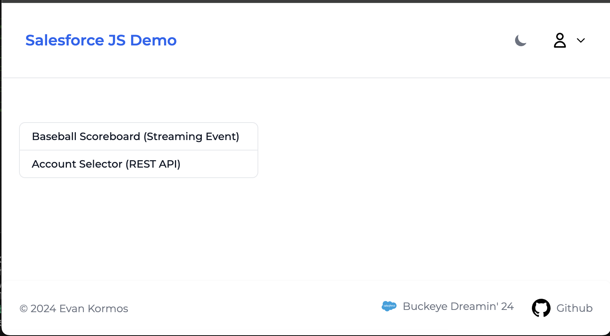
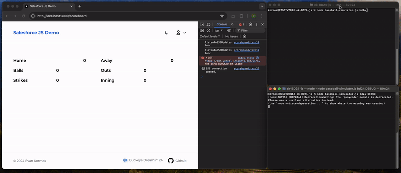
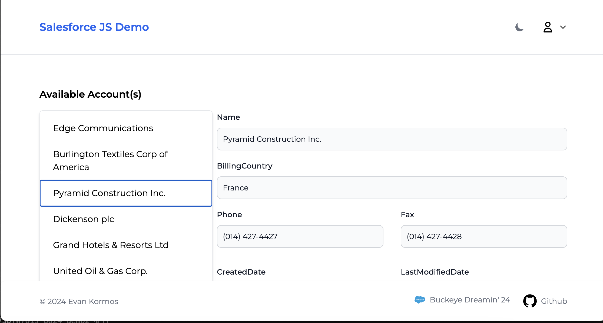

# Buckeye Dreamin' 24 - JavaScript Beyond LWC
### A [Presentation](https://github.com/kormco/ek-BD24-js/blob/main/demo-assets/JavaScript%20beyond%20LWC%20-%20Kormos%20-%20Buckeye%20Dreamin%202024.pdf) by [Evan Kormos](https://www.linkedin.com/in/evankormos)

Full stack JavaScript app powered by react + node connected to Salesforce using streaming and REST APIs using jsforce and other packages.  

This sample application is provided for educational purposes as-is with no warranty or guarantee.

### Demo

- Landing Page
  
  

- Streaming Baseball Scoreboard

  

- Account Browser
  
  

### Tech Stack:

-   [x] [Next.js](https://nextjs.org/)
-   [x] [NextAuth.js](https://next-auth.js.org)
-   [x] [jsforce](https://jsforce.github.io)
-   [x] [Tailwind](https://tailwindcss.com/)
-   [x] [Typescript](https://www.typescriptlang.org/)
-   [x] [Flowbite React Components](https://flowbite-react.com/)

### How to Run

1. [Generate a NextAuth Secret](https://generate-secret.vercel.app/32)
2. Create a connected app in your dev org enabled for OAuth, Device Flow, add all scopes (only for dev) 
3. you can use this app: https://generate-secret.vercel.app/32Create a new file for your local environment called ```.env.local``` in the root folder with the following settings:

   ```
    SALESFORCE_CLIENT_ID=YOUR_CLIENT_KEY
    SALESFORCE_CLIENT_SECRET=YOUR_SECRET_KEY
    SALESFORCE_URL_LOGIN=https://login.salesforce.com
    WDS_SOCKET_PORT=443
    NEXTAUTH_URL=http://localhost:3000
    NEXTAUTH_SECRET=YOUR_NEXTAUTH_SECRET
    ```

4. Clone the git project locally and install dependencies from npm, then run the server
   ```
    git clone https://github.com/pelayochristian/salesforce-next-auth.git
    cd salesforce-next-auth
    npm install
    npm run dev
   ```

5. Open [http://localhost:3000](http://localhost:3000) with your browser to open the home page and sign-in.


